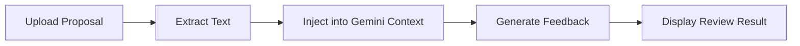
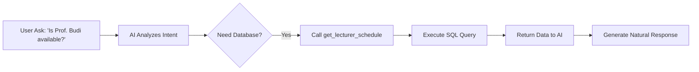

<div align="center">

# 🎓 KonsulKu
### *Elevating Academic Consultation with AI Intelligence*

[](https://golang.org/)
[](https://reactjs.org/)
[](https://gorm.io/)
[](https://ai.google.dev/)
[](https://aws.amazon.com/what-is/retrieval-augmented-generation/)
[](https://ai.google.dev/docs/function_calling)
[](https://golang.org/)
[](https://opensource.org/licenses/MIT)

---

**KonsulKu** is a full-stack platform designed to facilitate academic consultations. By integrating **Google Gemini AI**, the system provides intelligent preparation advice and document analysis to enhance the quality of student-lecturer interactions.

[Explore Features](#-key-features) • [View Architecture](#-system-architecture) • [Quick Start](#-installation--setup) • [Demo Credentials](#-demo-credentials)

</div>

## ✨ Key Features

-   🤖 **Agentic AI Assistant**: Powered by **Google Gemini** with **Function Calling** capability, allowing the AI to query the live database to check lecturer availability and profiles.
-   📄 **RAG (Retrieval-Augmented Generation)**: Intelligent Document Analysis that allows students to upload draft proposals (PDF/TXT) for instant, context-aware academic feedback.
-   💬 **Real-time Communication**: Seamless instant messaging powered by **WebSockets** for a responsive chat experience.
-   📅 **Smart Scheduling**: Comprehensive appointment lifecycle management (Pending, Approved, Rejected, Cancelled).
-   🔔 **Live Notifications**: Instant updates for new messages or appointment status changes.
-   🛡️ **Enterprise-Grade Security**: Role-Based Access Control (RBAC) and JWT authentication with Bcrypt encryption.
-   📜 **Audit Logging**: Structured JSON logging using **Logrus** for high-level observability.

---

## 🤖 AI Workflow

### 1. RAG (Document Analysis)
1. User upload file (PDF/TXT)
2. Backend extract text
3. Text is processed as context for the LLM
4. Context is sent to Gemini API
5. AI generates context-aware feedback
6. Response is rendered to the user



### 2. Agentic AI (Function Calling)
1. User interacts with AI assistant
2. AI analyzes intent and determines if data access is required
3. AI triggers a function call (e.g., `get_lecturer_schedule`)
4. Backend executes the function against the database
5. Data is returned to the AI model
6. AI generates a natural language response based on real-time data



## 🧠 AI Output Example

**Input:**
"Apakah judul skripsi saya sudah tepat?"

**Output:**
"Judul yang Anda ajukan sudah cukup spesifik, namun bagian metode penelitian masih belum tergambar jelas. Disarankan untuk menambahkan pendekatan penelitian..."

---

## 🔄 System Flow

1. **Authentication**: User login → JWT issued.
2. **Consultation**: User creates appointment → Data persisted to DB.
3. **AI Analysis**: User uploads document → RAG processing via Gemini.
4. **Communication**: Real-time chat with lecturers or AI → WebSocket.
5. **Updates**: System pushes real-time status notifications.

---

## 🚀 AI-Assisted Engineering & Leadership

This project showcases modern **Software Engineering Leadership**. While the codebase was co-authored with an Advanced AI Assistant, the **Architecture, Debugging Direction, and Problem Solving** were strictly human-led. Key highlights of this human-AI collaboration include:

- **System Architecture & Vision:** Architecting the end-to-end flow from React frontend to Go backend, integrating MySQL, WebSockets, and Google Gemini API.
- **Complex Debugging:** Successfully directing the AI to resolve deep OS-level networking blocks (e.g., Windows socket/port binding issues) and identifying logic gaps in WebSocket payload delivery.
- **Advanced Problem Solving:** When the Gemini API rejected binary `.docx` files with "invalid UTF-8" errors, the AI was guided to build a native Go `archive/zip` and `encoding/xml` parser to extract raw text, completely bypassing external dependencies.
- **Iterative Refinement:** Designing the state management flow in React Router to dynamically pass student profiles between components, transforming static mockups into a fully functional, data-driven Chat UI.

This project proves the ability to not just write code, but to **lead, manage, and orchestrate** advanced AI tools to build enterprise-grade applications.

---

## 🏗️ System Architecture & Technical Decisions

- **Go (Gin)**: High-performance backend with efficient concurrency handling.
- **WebSocket**: Real-time bidirectional communication for chat and notifications.
- **Gemini AI**: Supports function calling for agentic workflows and advanced document analysis.
- **RAG (Retrieval-Augmented Generation)**: Improves AI accuracy by grounding responses in user-provided documents.
- **Clean Architecture**: Separation of concerns (Handlers, Services, Repositories) for scalability and maintainability.
- **MySQL (GORM)**: Robust relational data management with an ORM layer.

---

## 📡 API Endpoints

### 🔐 Authentication
- `POST /api/login`
- `POST /api/register`

### 👨‍🎓 Users
- `GET /api/users`
- `GET /api/users/:id`

### 📅 Consultations
- `GET /api/consultations`
- `POST /api/consultations`
- `PUT /api/consultations/:id`
- `DELETE /api/consultations/:id`

### 💬 Chat (WebSocket)
- `WS /api/ws/chat`

#### Example Request: `POST /api/login`
**Request Body:**
```json
{
  "username": "20010101",
  "password": "password123"
}
```
**Response:**
```json
{
  "token": "jwt_token_here",
  "role": "mahasiswa"
}
```

---

## 🔧 Installation & Setup

### 1. Backend Setup
```bash
# Clone the project
git clone https://github.com/luckymalombeke/system-konsulku.git

# Configure Environment
cp .env.example .env # Ensure DB and GROQ_API_KEY are set

# Run the engine
go run main.go
```

### 2. Frontend Setup
```bash
cd frontend-UI-fix
npm install
npm run dev
```

---

## 🔐 Demo Credentials

The system includes an **Auto-Seeder**. On the first run, you can use these accounts to explore:

| Role | Username (ID) | Password |
| :--- | :--- | :--- |
| **Mahasiswa** | `20010101` | `password123` |
| **Dosen** | `19800101` | `password123` |

---

## 📄 License

Distributed under the MIT License. See `LICENSE` for more information.

<div align="center">

Built with 💜 by **Lucky Malombeke**

</div>
