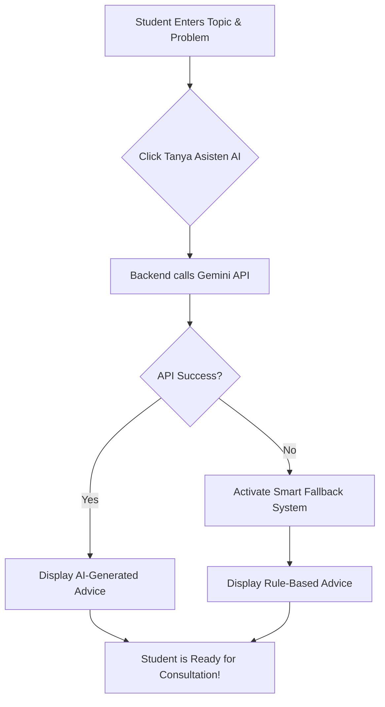

<div align="center">

# 🎓 KonsulKu
### *Elevating Academic Consultation with AI Intelligence*

[](https://golang.org/)
[](https://reactjs.org/)
[](https://gorm.io/)
[](https://ai.google.dev/)
[](https://opensource.org/licenses/MIT)

---

**KonsulKu** is a cutting-edge, full-stack platform designed to revolutionize the way students and lecturers interact. By integrating **Google Gemini AI**, we don't just schedule meetings—we empower students to prepare for them.

[Explore Features](#-key-features) • [View Architecture](#-system-architecture) • [Quick Start](#-installation--setup) • [Demo Credentials](#-demo-credentials)

</div>

## ✨ Key Features

-   🤖 **AI Consultation Assistant**: Integrated with Google Gemini to analyze consultation topics and provide smart preparation advice.
-   💬 **Real-time Communication**: Seamless instant messaging powered by **WebSockets** for a responsive chat experience.
-   📅 **Smart Scheduling**: Comprehensive appointment lifecycle management (Pending, Approved, Rejected, Cancelled).
-   🔔 **Live Notifications**: Instant updates for new messages or appointment status changes.
-   🛡️ **Enterprise-Grade Security**: Role-Based Access Control (RBAC) and JWT authentication with Bcrypt encryption.
-   📜 **Audit Logging**: Structured JSON logging using **Logrus** for high-level observability.

---

## 🧠 AI Integration Workflow

How the AI Assistant helps students prepare:



---

## 🏗️ System Architecture

This project implements a **Clean Layered Architecture** for maximum maintainability:

-   **Frontend**: React (Vite) + Tailwind CSS (Responsive UI)
-   **Backend**: Go (Gin Gonic)
-   **Database**: MySQL (GORM)
-   **Real-time**: Gorilla WebSocket
-   **Service Layer**: Handles complex logic like Gemini AI integration and Fallback mechanisms.

---

## 🔧 Installation & Setup

### 1. Backend Setup
```bash
# Clone the project
git clone https://github.com/luckymalombeke/system-konsulku.git

# Configure Environment
cp .env.example .env # Ensure DB and GEMINI_API_KEY are set

# Run the engine
go run main.go
```

### 2. Frontend Setup
```bash
cd frontend-UI-fix
npm install
npm run dev
```

---

## 🔐 Demo Credentials

The system includes an **Auto-Seeder**. On the first run, you can use these accounts to explore:

| Role | Username (ID) | Password |
| :--- | :--- | :--- |
| **Mahasiswa** | `20010101` | `password123` |
| **Dosen** | `19800101` | `password123` |

---

## 📄 License

Distributed under the MIT License. See `LICENSE` for more information.

<div align="center">

Built with 💜 by **Lucky Malombeke**

</div>
