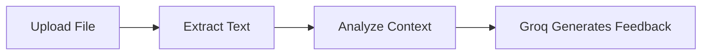
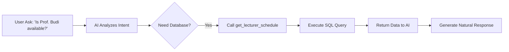

<div align="center">

# 🎓 KonsulKu
### *Elevating Academic Consultation with AI Intelligence*

---

## 🚀 Live Links
- **🌐 Live Web App**: [https://system-konsulku.vercel.app](https://system-konsulku.vercel.app)
- **⚙️ API Backend**: [https://konsulku-production.up.railway.app](https://konsulku-production.up.railway.app)
- **🗄️ Database**: Supabase PostgreSQL Cloud

---

[](https://golang.org/)
[](https://reactjs.org/)
[](https://supabase.com/)
[](https://gorm.io/)
[](https://groq.com/)
[](https://ai.google.dev/)
[](https://golang.org/)
[](https://opensource.org/licenses/MIT)

---

**KonsulKu** is a full-stack platform designed to facilitate academic consultations. By integrating **Groq AI (Llama 3)**, the system provides intelligent preparation advice and document analysis to enhance the quality of student-lecturer interactions.

[Explore Features](#-key-features) • [View Architecture](#-system-architecture) • [Quick Start](#-installation--setup) • [Demo Credentials](#-demo-credentials)

</div>

## ✨ Key Features

-   🤖 **Groq-Powered AI Assistant**: High-performance agentic chat workflows and document analysis using **Llama 3** via Groq API for lightning-fast responses.
-   📄 **Advanced RAG (Retrieval-Augmented Generation)**: Implements native text chunking and semantic search to extract relevant thesis contexts. Supports `.docx` and `.pdf` uploads.
-   💬 **Real-time Communication**: Seamless instant messaging powered by **WebSockets** for a responsive chat experience.
-   📅 **Dynamic Scheduling**: Allows students to request custom consultation time ranges, pending lecturer approval, replacing rigid time slots.
-   🔔 **Live Notifications**: Instant updates for new messages or appointment status changes.
-   🛡️ **Enterprise-Grade Security**: Role-Based Access Control (RBAC) and JWT authentication with Bcrypt encryption.
-   📜 **Audit Logging**: Structured JSON logging using **Logrus** for high-level observability.

---

## 🤖 AI Workflow

### 1. Document Analysis (RAG-Ready)
1. User uploads proposal (.docx or .pdf)
2. Backend extracts raw text using native Go parsers.
3. Relevant text contexts are processed to generate academic feedback.
4. AI generates review, evaluation, and suggestions based on the proposal content.



### 2. Agentic AI (Function Calling)
1. User interacts with AI assistant
2. AI analyzes intent and determines if data access is required
3. AI triggers a function call (e.g., `get_lecturer_schedule`)
4. Backend executes the function against the database
5. Data is returned to the AI model
6. AI generates a natural language response based on real-time data



## 🧠 AI Output Example

**Input:**
"Apakah judul skripsi saya sudah tepat?"

**Output:**
"Judul yang Anda ajukan sudah cukup spesifik, namun bagian metode penelitian masih belum tergambar jelas. Disarankan untuk menambahkan pendekatan penelitian..."

---

## 🔄 System Flow

1. **Authentication**: User login → JWT issued.
2. **Consultation**: User creates appointment → Data persisted to DB.
3. **AI Analysis**: User uploads document → Document processing via Groq AI.
4. **Communication**: Real-time chat with lecturers or AI → WebSocket.
5. **Updates**: System pushes real-time status notifications.

---

## 🏗️ System Architecture & Technical Decisions

- **Go (Gin)**: High-performance backend with efficient concurrency handling.
- **WebSocket**: Real-time bidirectional communication for chat and notifications.
- **Groq AI (Llama 3)**: Lightning-fast inference for both chat and document analysis.
- **Cloud Database (Supabase)**: Leveraging PostgreSQL on Supabase for scalable, production-ready data storage and management.
- **Clean Architecture**: Separation of concerns (Handlers, Services, Repositories) for scalability and maintainability.

---

## 📡 API Endpoints

### 🔐 Authentication
- `POST /api/login`
- `POST /api/register`

### 👨‍🎓 Users
- `GET /api/users`
- `GET /api/users/:id`

### 📅 Consultations
- `GET /api/consultations`
- `POST /api/consultations`
- `PUT /api/consultations/:id`
- `DELETE /api/consultations/:id`

### 💬 Chat (WebSocket)
- `WS /api/ws/chat`

---

## 🔧 Installation & Setup

### Prerequisites
- **Go 1.25+**
- **Node.js & npm**
- **XAMPP / MySQL Server**: Ensure your local MySQL server is running (or use Supabase).
- **API Key**: Groq API Key.

### 1. Database Setup (Supabase)
1. Create a new project on [Supabase](https://supabase.com/).
2. Get your **PostgreSQL Connection String** from the Database settings.
3. Ensure the connection string is used as the `DATABASE_URL` in your `.env` file.

### 2. Backend Setup
```bash
# Clone the project
git clone https://github.com/luckymalombeke/system-konsulku.git

# Configure Environment
cp .env.example .env 
# Edit .env and ensure DB credentials and GROQ_API_KEY are set.

# Install dependencies and Run the engine
go mod tidy
go run main.go
```

### 2. Frontend Setup
```bash
cd frontend-UI-fix
npm install
npm run dev
```

---

## 🔐 Demo Credentials

The system includes an **Auto-Seeder**. On the first run, you can use these accounts to explore:

| Role | Username (ID) | Password |
| :--- | :--- | :--- |
| **Mahasiswa** | `20010101` | `password123` |
| **Dosen** | `19800101` | `password123` |

---

## 📄 License

Distributed under the MIT License. See `LICENSE` for more information.

<div align="center">

Built with 💜 by **Lucky Malombeke**

</div>
